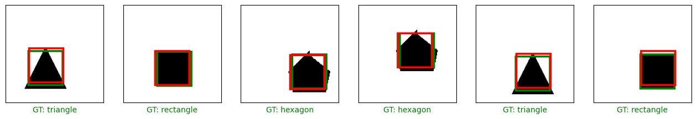

# Object Localization with Custom Generated Geometry Images: CNN Model

This repository presents a project on object localization using custom-generated geometry images. The dataset consists of images of various geometric shapes, including circles, triangles, rectangles, and hexagons. Each shape is associated with a unique label, and the dataset is structured as follows:

- 0: circle
- 1: triangle
- 2: rectangle
- 3: hexagon

## Dataset
The dataset contains images of four geometric shapes, each represented by a PNG file. The images are labeled accordingly, making it suitable for object localization tasks.

## Model Training
A Convolutional Neural Network (CNN) model is trained on the dataset for object localization. The CNN architecture is designed to accurately localize the geometric shapes within the images.

## Usage
To use the model:
1. Clone the repository to your local machine.
2. Install the necessary dependencies (TensorFlow, Keras, etc.).
3. Preprocess the dataset and organize it into appropriate directories.
4. Train the CNN model using the provided scripts or notebooks.
5. Evaluate the model's performance and visualize the localization results.

## Results
The trained CNN model should be able to accurately localize geometric shapes within the images. The results can be visualized and analyzed to assess the model's performance.

## Contribution
Contributions to improve the model's performance or add new features are welcome. Please submit a pull request with a detailed description of the proposed changes.

